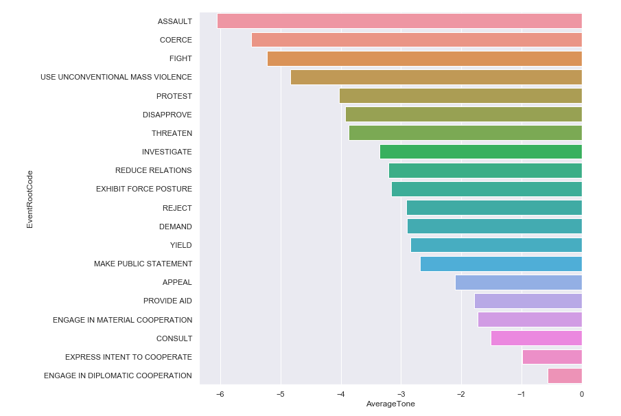
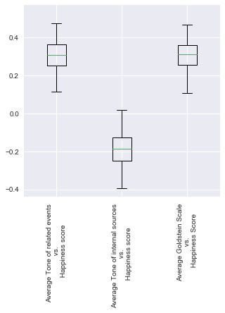
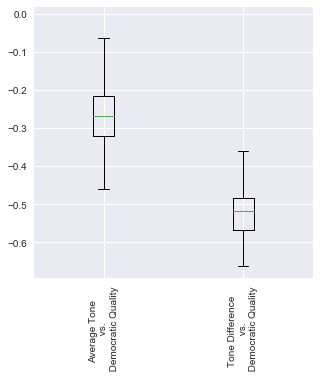
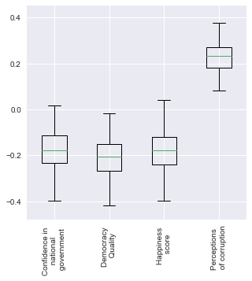
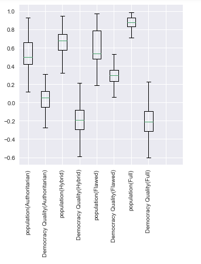

# Study of the fidelity of media, as representations of the society state

# Abstract
We all know that the media have a strong influence on our information-driven societies. We could imagine that their primary purpose would be to inform objectively and to reflect the state of mind of all, or part of, the population. But are they really ? We also hear a lot about the polarization of the media, but what is it really about?  It is always useful to know under what degree of objectivity the information is transmitted, to avoid being influenced too easily.

In our project we aim to analyze the relation between the media and the current state of our society. In order to do so, we will use the GDELT V2.0 dataset, allowing to explore on several axes, such as time, localisation and recurring themes. Moreover, based on the UN “World happiness report”, we will look if there is a correlation between the state of mind of the inhabitants, as well as, some important political factors such as corruption, confidence in the government and democracy index per country and their respective media landscape.

# Research questions
We will guide our work with the following questions:
  - Are media anxiogenic in their way of telling stories?
  - Is there a correlation between a country and the emotions transmitted by its media ?
  - Can we find a link with its political system ?
  - Can media reliably translate the state of happiness of a country ?  
  - Protests, events which have a considerable amount on the stability of countries, are remarkably over-mentioned in the media for specific countries?
  - Can protests be related to the country intrinsic factors such as population, political regime?  

# Dataset
[GDELT V2](https://www.gdeltproject.org/data.html#documentation) gathering a huge amount of information about events happening all around the world and their corresponding media coverage. This dataset is composed of three distinct parts : Event table, Mention table and a Global Knowledge Graph (GKG). The latter will be omitted in this analysis.
  * **Event table** uniquely records global events, along with principal components and actors. We will be mostly interested in the fields GlobalEventId, EventRootCode, GoldsteinScale, AvgTone and ActionGeo_CountryCode .
* **Mention table** records all individual mentions of each event. We will be interested in similar fields as for the Event table.
In these two tables, records are stored one per line, tab-delimited.

More details about the fields can be found on the [codebook](http://data.gdeltproject.org/documentation/GDELT-Event_Codebook-V2.0.pdf).
In order to use this rather big dataset, we will have to preprocess it on Google BigQuery, a data processing interface which contains already the GDELTV2 data and an extremely helpful tool enabling the processing this large dataset very fast.

  - [World Happiness Report](http://worldhappiness.report/) gathers data objective data on the state of mind of the inhabitants of most countries of the world. This rather simple CSV dataset also contains other interesting state indicators such as the  *Corruption*, *Confidence in the government*.

  - [Democracy Index 2017](https://en.wikipedia.org/wiki/Democracy_Index), index compiled by the Economist Intelligence Unit (EIU), gives the ranking of 167 countries regarding to their democracy quality.

  - A gentle reminder: We decided to use the Democracy Index report to have an idea about country democracy qualities rather than the World Happiness Report which also contains information about democracy of countries for the one and only reason which is Democracy Index report allows us to put countries in 4 different categories namely *full democracy*, *flawed democracy*, *hybrid regime* and *authoritarian*.

# Highlights:
  * The following graph shows that media are following a negative tone whatever the event is:
  

  * Surprisingly, the subjective well-being is negatively correlated to the average tone of the media inside a country.
  On the other hand, the international representation of a country, in terms of tone, correlates with its Happiness score.
  Moreover, the stability of the country, represented by the Golstein Scale indicator is also correlated to the Happiness score.

  

    
  

  * A negative correlation is also found between the Democracy index and the average tone of the media inside a country. In addition, there is a negative correlation between the Democracy index of a country and its bias in terms of representative tone.

  

    
  

  * The following figure states that there is a positive correlation between corruption and the weight of protest news among all the news for a     country and a negative correlation between happiness score, confidence in government, democracy index and again the importance of protest news in media for a country:

  

    
  

  * One can visualize the box plots for correlation factors between protest events and democracy quality and population for each category of democracy (Authoritarian, Hybrid Regime, Flawed Democracy, Full Democracy) on the following figure:
  

    
  

  Please notice that the more the country becomes democratic, more the protests are correlated with the population.

# Work Repartition
  Given the tasks required by our project, we can easily mention that each teammate worked properly on every single part to improve the quality of the project. Here is still a view of work repartition since we are asked to do so:
  * Sinan Gökçe:

  * Juliane Dervaux:

  * Lucas Burget:  
